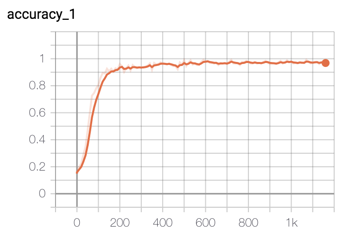

# 文本分类智能量刑

项目数据来源于“新华三杯大连地区高校大数据竞赛”限选题第一题。要求根据案情事实（fact字段），预测嫌疑人的罪名信息（accusation字段）。

原始数据集链接：https://pan.baidu.com/s/12IESi6s50649-jtyPQo3Cw 提取码：bfxu 

本项目训练了其中的十个分类：
	
	“危险驾驶”、“交通肇事”、“盗窃”、“信用卡诈骗”、“容留他人吸毒”、“故意伤害”、“抢劫”、“寻衅滋事”、“走私、贩卖、运输、制造毒品”、“诈骗”

通过[preprocess/dataset.py](ml/dataset.py)脚本的处理，对数据集的划分如下：

- 训练集：3000 * 10 = 30000
- 验证集：300 * 10 = 3000
- 测试集：600 * 10 = 6000

项目分别使用传统机器学习模型和TextRNN模型进行实验。

## 环境

- python 3.6.5
-  numpy 1.16.4
- pandas 0.24.2
- sklearn 0.21.2
- lightgbm 2.2.4
- jieba 0.39
- tensorflow 1.14

## 实验结果

### 传统机器学习

首先，利用jieba分词工具对文本进行分词，根据停用词表去除停用词和单字词。接着，使用分词特征、bigram特征和bigram/trigram特征，使用tf-idf权重计算方法和chi2特征选择方法，从5000维词袋特征中抽取500维特征。最后，使用逻辑回归、SVM、朴素贝叶斯和LightGBM等机器学习模型，以及OvR多分类策略，对文本进行分类。

文件说明如下（machine\_learning/）：

- preprocessing.py：脚本文件，负责文本与标签的预处理。
- ml\_model.py：各个机器学习分类器。
- run.py：特征工程与实验设置。

实验结果如下（只展示了分词特征分类结果）：

	-----------------------LR-----------------------
	>>> 模型训练...
	train time cost: 28.5143 s
	>>> 模型预测...
	predict time cost: 0.0277 s
	>>> 模型评估...
	              precision    recall  f1-score   support
	
	      交通肇..	       0.87      0.99      0.93       600
	      信用卡..	       0.88      0.97      0.93       600
	      危险驾..	       0.92      0.96      0.94       600
	      容留他..	       0.94      0.99      0.97       600
	      寻衅滋..	       0.42      0.98      0.59       600
	       抢劫..	       0.62      0.99      0.76       600
	      故意伤..	       0.59      0.99      0.74       600
	       盗窃..	       0.66      0.98      0.79       600
	       诈骗..	       0.71      0.99      0.82       600
	      走私、..	       0.92      0.99      0.95       600
	
	   micro avg       0.71      0.99      0.82      6000
	   macro avg       0.75      0.99      0.84      6000
	weighted avg       0.75      0.99      0.84      6000
	 samples avg       0.81      0.99      0.87      6000
	
	宏F1与微F1的均值： 0.8334614554184199
	-----------------------SVM-----------------------
	>>> 模型训练...
	train time cost: 7647.4775 s
	>>> 模型预测...
	predict time cost: 204.957 s
	>>> 模型评估...
	              precision    recall  f1-score   support
	
	      交通肇..	       0.88      0.98      0.93       600
	      信用卡..	       0.94      0.90      0.92       600
	      危险驾..	       0.93      0.95      0.94       600
	      容留他..	       0.95      0.99      0.97       600
	      寻衅滋..	       0.74      0.81      0.77       600
	       抢劫..	       0.88      0.93      0.90       600
	      故意伤..	       0.75      0.92      0.83       600
	       盗窃..	       0.83      0.93      0.87       600
	       诈骗..	       0.88      0.91      0.89       600
	      走私、..	       0.90      0.97      0.93       600
	
	   micro avg       0.86      0.93      0.89      6000
	   macro avg       0.87      0.93      0.90      6000
	weighted avg       0.87      0.93      0.90      6000
	 samples avg       0.87      0.93      0.89      6000
	
	宏F1与微F1的均值： 0.8950619167786962
	-----------------------LGB-----------------------
	>>> 模型训练...
	train time cost: 53.3144 s
	>>> 模型预测...
	predict time cost: 0.6205 s
	>>> 模型评估...
	              precision    recall  f1-score   support
	
	      交通肇..	       0.99      0.99      0.99       600
	      信用卡..	       0.96      0.97      0.97       600
	      危险驾..	       0.99      0.97      0.98       600
	      容留他..	       0.99      0.99      0.99       600
	      寻衅滋..	       0.86      0.89      0.87       600
	       抢劫..	       0.96      0.95      0.96       600
	      故意伤..	       0.87      0.96      0.91       600
	       盗窃..	       0.93      0.96      0.95       600
	       诈骗..	       0.94      0.97      0.95       600
	      走私、..	       0.99      0.98      0.99       600
	
	   micro avg       0.94      0.96      0.95      6000
	   macro avg       0.95      0.96      0.95      6000
	weighted avg       0.95      0.96      0.95      6000
	 samples avg       0.95      0.96      0.95      6000
	
	宏F1与微F1的均值： 0.954425146926486

实验结果分析如下：（具体的实验结果请见machine\_learning/result.txt）

（1）分词、bigram和trigram？

一般来讲，当特征维度很大时，分词特征和bigram特征效果比较相近。但从本项目的实验结果来看，bigram以及bigram/trigram特征没有分词特征效果好。观察特征选择后的分词特征和bigram特征，可以发现分词特征不仅含有二字串，还包含了如：“情节恶劣”、“交通事故”、“农业银行”等固定短语，这些固定短语特征在文本分类中可能起到了很大的作用。

（2）LR、SVM和LightGBM？

首先，观察指标宏微F1平均值，LightGBM要优于SVM，SVM优于LR。其次，从时间效率来看，SVM适合于高维度小数据集（SVM求解的对偶问题的时间复杂度是样本规模的函数），因而无论是训练和预测都非常耗时。LR模型简单，效率高。LightGBM虽然效率没有LR高，但准确率超越了LR不只一点点。

### TextRNN

由于本项目面对的数据是长文本（文本字符数中位数为297），有一些文本的时序信息比较重要。因此采用TextRNN模型进行分类。模型结构如下：

文件说明如下（textrnn/）：

- rnn\_model.py：TextRNN模型及其配置。
- functions.py：构建词汇表、文本序列生成、标签、训练、测试等函数。
- run.py：实验设置。

实验结果如下：

训练用时大概2h，经过了10个epoch迭代停止，在验证集上的最佳效果为94.97%，测试集上的最佳效果为93.82%。

	Test Loss:   0.24, Test Acc:  93.82%
	              precision    recall  f1-score   support
	
	           0       0.97      0.95      0.96       600
	           1       0.99      0.98      0.99       600
	           2       0.96      0.94      0.95       600
	           3       0.97      0.95      0.96       600
	           4       0.99      0.97      0.98       600
	           5       0.81      0.93      0.87       600
	           6       0.96      0.91      0.94       600
	           7       0.85      0.79      0.82       600
	           8       0.97      0.98      0.98       600
	           9       0.92      0.96      0.94       600
	
	    accuracy                           0.94      6000
	   macro avg       0.94      0.94      0.94      6000
	weighted avg       0.94      0.94      0.94      6000
	
	[[568   3   4   2   0   9   2   8   0   4]
	 [  4 589   0   0   0   3   1   1   0   2]
	 [  2   0 566   3   1   1   3   6   1  17]
	 [  3   0   6 572   0   2   0   2   1  14]
	 [  0   0   0   0 585   1   0   1  11   2]
	 [  1   1   1   0   0 559   2  35   1   0]
	 [  0   1   9   1   0   6 547  30   0   6]
	 [  3   0   1   1   0 105  11 475   1   3]
	 [  1   0   1   0   6   0   0   1 589   2]
	 [  1   1   4   8   1   1   1   3   1 579]]
	 
	0:危险驾驶;1:交通肇事;2:盗窃;3:信用卡诈骗;4:容留他人吸毒;5:故意伤害;6:抢劫;7:寻衅滋事;8:走私、贩卖、运输、制造毒品;9:诈骗

准确率和误差如图所示：

bad case分析：

测试集中的bad case一共有371例，排名前五的误分类为如下。从中可以知道，寻衅滋事与故意伤害之间很难区分。可以通过增加该类样本的loss权重来解决。

	label		pred	count
	寻衅滋事	故意伤害	105
	故意伤害	寻衅滋事	35
	抢劫		寻衅滋事	30
	盗窃		诈骗		17
	信用卡诈骗	诈骗		14